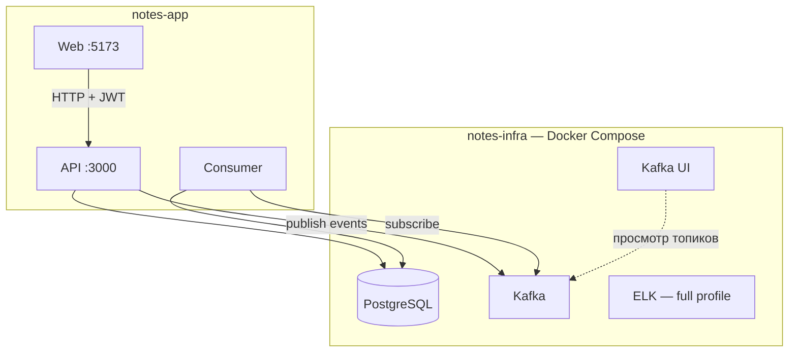

# DevOps-тур по Notes App

Пошаговый разбор для тех, кто только начинает разбираться в инфраструктуре.  
Репозитории: **notes-infra** (платформа) + **notes-app** (приложение).

---

## 1. Кто за что отвечает



| Репозиторий | Роль аналогия | Что поднимает |
|-------------|---------------|---------------|
| **notes-infra** | Platform / SRE | Postgres, Kafka, логи |
| **notes-app** | Product team | API, UI, consumer |

**Важно:** приложение **не** читает `.env` из infra автоматически. Контракт — одинаковые порты и пароли в двух файлах (или скрипт `sync-env`).

---

## 2. Переменные окружения — «договор» между репо

```
notes-infra/.env                    notes-app/apps/api/.env
─────────────────                   ─────────────────────────
POSTGRES_PORT=5433          →       DATABASE_URL=...@localhost:5433/...
POSTGRES_USER/PASSWORD      →       (в URL)
KAFKA_PORT=9093             →       KAFKA_BROKERS=localhost:9093
```

Синхронизация одной командой:

```bash
cd notes-app
make sync-env
# или: ./scripts/sync-env-from-infra.sh
```

---

## 3. Порядок запуска (happy path)

```bash
# 1. Инфраструктура
cd notes-infra
make up          # или ./scripts/up.sh
make health      # дождаться Postgres + Kafka

# 2. Приложение (первый раз)
cd ../notes-app
make sync-env
make setup       # npm install, migrate, seed admin/admin
make dev         # api + consumer + web

# 3. Проверка
make status
```

| URL | Зачем |
|-----|-------|
| http://localhost:5173 | Web UI (admin / admin) |
| http://localhost:3000/api/docs | Swagger |
| http://localhost:3000/api/v1/health/ready | Readiness (Postgres + Kafka) |
| http://localhost:8080 | Kafka UI |

---

## 4. Сценарий: «Создал заметку — что произошло?»

1. **Web** → `POST /api/v1/notes` с JWT
2. **API** → запись в **PostgreSQL** (таблица `Note`)
3. **API** → сообщение в Kafka топик `notes.created`
4. **Consumer** → читает топик → пишет в `EventAudit`
5. **Web / Events** → показывает событие из БД (poll каждые 5 сек)
6. **Kafka UI** → то же сообщение в топике (сырой вид)

Проверь сам:

1. Login → Notes → создай заметку
2. Открой **Events** в web
3. Открой **Kafka UI** → Topics → `notes.created`

Если Events пусто, а Kafka UI есть сообщения → **consumer не работает**.  
Если и там пусто → **API не публикует** или infra не поднята.

---

## 5. Health checks — зачем два endpoint

| Endpoint | Тип | Назначение |
|----------|-----|------------|
| `GET /api/v1/health` | **Liveness** | Процесс API жив (для оркестратора) |
| `GET /api/v1/health/ready` | **Readiness** | API может работать: Postgres (+ статус Kafka) |

Пример readiness:

```bash
curl -s http://localhost:3000/api/v1/health/ready | jq
```

```json
{
  "status": "ok",
  "service": "notes-api",
  "checks": {
    "postgres": { "status": "up", "latencyMs": 3 },
    "kafka": { "status": "up", "latencyMs": 12 }
  }
}
```

- `status: error` + HTTP **503** → Postgres недоступен (infra не поднята или неверный `DATABASE_URL`)
- `status: degraded` → Postgres ок, Kafka нет (заметки сохраняются, события пропускаются)

---

## 6. Скрипты и Makefile

### notes-infra

| Команда | Действие |
|---------|----------|
| `make up` | Postgres + Kafka + Kafka UI |
| `make up-full` | + Elasticsearch + Kibana + Filebeat |
| `make status` | Быстрая проверка контейнеров |
| `make health` | Ждать готовности (для CI/скриптов) |
| `make backup` | `pg_dump` в `backups/` |

### notes-app

| Команда | Действие |
|---------|----------|
| `make sync-env` | Подтянуть URL из notes-infra |
| `make setup` | Установка + миграции + seed |
| `make dev` | Все сервисы приложения |
| `make status` | Infra + API + Web |

---

## 7. Бэкап базы (stateful-сервис)

```bash
cd notes-infra
make backup
# → backups/notes-YYYYMMDD-HHMMSS.sql

# Восстановление (осторожно — перезапишет данные):
./scripts/restore-db.sh backups/notes-....sql
```

**Зачем DevOps:** данные в Postgres переживают рестарт контейнера, но не переживают `docker volume rm` без бэкапа.

---

## 8. Логи (full profile)

```bash
cd notes-infra
make up-full
```

1. API пишет JSON в stdout (`pino`)
2. Filebeat собирает логи контейнеров
3. Elasticsearch хранит
4. Kibana → Discover → ищи по `correlationId`

---

## 9. CI/CD (что уже есть)

| Репо | Workflow | Что проверяет |
|------|----------|---------------|
| notes-infra | `validate.yml` | `docker compose config` |
| notes-app | `ci.yml` | lint, test, build |
| notes-app | `publish.yml` | Docker-образы в GHCR (по тегу) |

---

## 10. Что учить дальше

1. ✅ Docker Compose, env, health — **этот проект**
2. 📋 Chaos-упражнения → [CHAOS-LAB.ru.md](./CHAOS-LAB.ru.md)
3. 🔜 Prometheus + Grafana (метрики)
4. 🔜 Деплой compose/GHCR на VPS
5. 🔜 Kubernetes (когда Compose понятен)

---

## Связанные документы

- [QUICKSTART.ru.md](./QUICKSTART.ru.md) — установка
- [architecture.md](./architecture.md) — схема компонентов
- [notes-infra README](https://github.com/WeissbergAA/notes-infra) — инфраструктура
